# Table of Contents
- [Features](#features)
- [UX Plane](#ux-plane)

- [Data Flow Map](#data-flow-map)
- [Tests and Results](#tests-and-results)
- [Deployment](#deployment)
- [Resources](#resources)
- [Credits](#credits)
- [Contact](#contact)

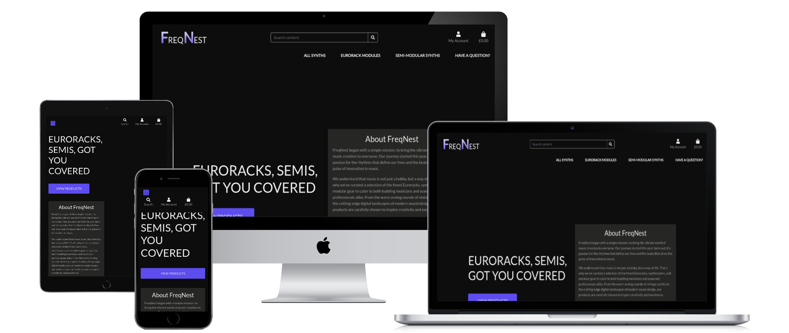

## Features
Welcome to FreqNest, where we blend passion for music with technology to create an unmatched synth shopping experience. Here's a closer look at the features that make your journey with us special.

## Live View
Check out FreqNest live: [FreqNest Live Demo](https://freqnest-72f2ca52bd2b.herokuapp.com/)

### Easy Registration: Your First Step into Our World
- **Simple Sign-Up Process**: Joining FreqNest is easy. Choose a unique username, provide your email, create a secure password, and you're in.
- **Personalized Experience**: Your account opens the door to features like saved favorites, order tracking, and personalized recommendations.

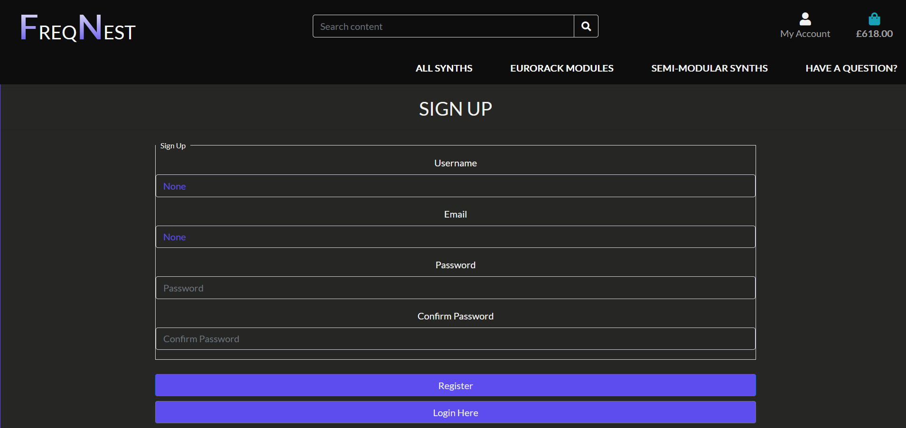

### Your Personal Music Profile: Control at Your Fingertips
- **Manage Your Details**: Update your username, email, and contact information with ease.
- **Order History**: View all your past orders and their details in one place.
- **Account Deletion**: Your privacy and choices are respected—delete your account anytime if you choose to leave.

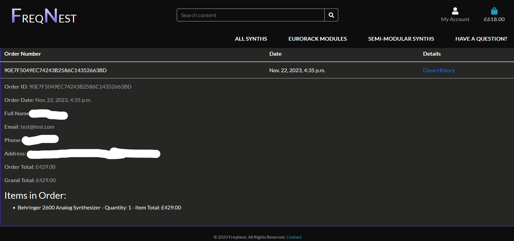

### Shopping Cart: Your Curated Synth Collection
- **Review and Adjust**: Easily add, review, and remove synths from your cart.
- **Transparent Pricing**: See the total cost of your selections before proceeding to checkout.

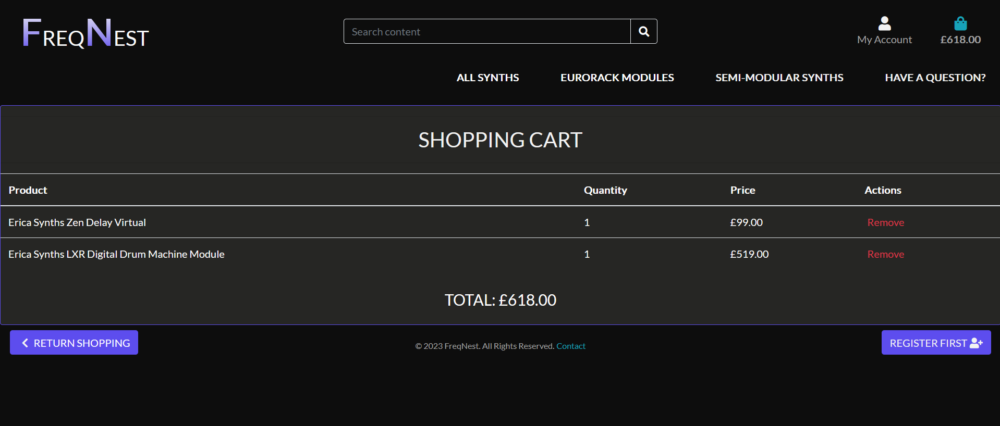

### Explore Our Synths Collection: A Musical Adventure
- **Diverse Range**: From vintage to modern, our collection caters to all tastes and needs.
- **User-Friendly Browsing**: Sort and filter synths to find your perfect match quickly.
- **Detailed Synth Views**: Click on any synth for an in-depth look at its features and specs.

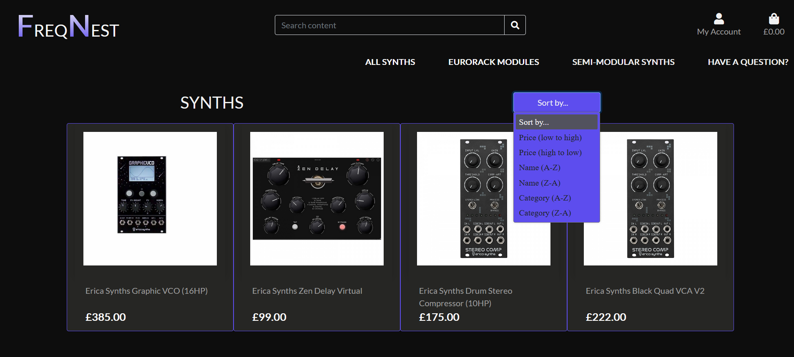

### Secure Checkout: Smooth and Safe Transaction
- **Effortless Checkout Process**: Fill out your details and proceed to payment without any hassle.
- **Stripe Integration**: Enjoy peace of mind with secure payment processing by Stripe.
- **Privacy Ensured**: We safeguard your personal information at every step.

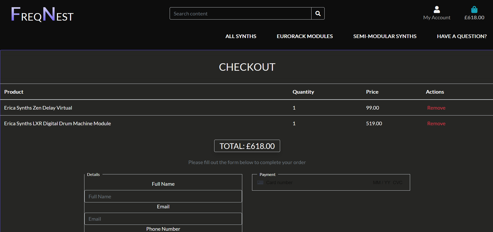

## UX Plane
Creating FreqNest, I focused on each aspect of the user experience, ensuring that your journey through the world of synthesizers is both enjoyable and intuitive. Here's how I approached the different UX planes for FreqNest.

### Strategy Plane
- **User Needs**: You, the synth enthusiasts, are looking for a diverse range of products, clear information, and a seamless shopping experience.
- **My Goals**: To provide an easy-to-navigate, informative, and comprehensive online platform catering to all your synth needs.
- **My Goals**: To provide an easy-to-navigate, informative, and comprehensive online platform catering to all your synth needs.

### Scope Plane
- **Features**: Detailed product descriptions, a secure shopping cart, user profile management, and an efficient checkout process.
- **Content Requirements**: High-quality images, informative product descriptions, and straightforward navigation for an educational and enjoyable visit.

### Structure Plane
- **Information Architecture**: Intuitive product categories and an easy-to-understand layout.
- **Interaction Design**: Interactive elements like sorting options and clickable categories enhance your exploration and purchasing process.

### Skeleton Plane
- **Interface Design**: Clean and visually appealing interface, showcasing synths effectively.
- **Navigation Design**: Consistent and clear menu structures for quick and efficient user navigation.

### Surface Plane
- **Visual Design**: Aesthetically pleasing design that resonates with your passion for synths, utilizing colors, typography, and imagery.
- **Sensory Experience**: Engaging and immersive experience, capturing the essence and excitement of the synthesizer world.

## Technologies and Frameworks Utilized for FreqNest
Building FreqNest was an exciting journey, and here are the tools I used:

### Frontend Development
- **HTML5 and CSS3**: Structuring and styling the website.
- **JavaScript and jQuery**: Adding interactivity for a dynamic browsing experience.

### Backend Development
- **Django**: High-level Python Web framework for a robust, secure, and scalable application.
- **Python**: Core programming language for efficiency and readability.

### Database Management
- **PostgreSQL**: Storing and managing user data, product information, and crucial data reliably.

### Payment Processing
- **Stripe**: Integrated for secure online transactions.

# Tests and Results

The application underwent rigorous testing across various components. Here's a detailed breakdown of each test, its respective results, and the encountered issues:

### Cart App Testing

#### Test 1: Adding Items
- **Objective**: Ensure users can add synths to their cart.
- **Result**: The functionality works correctly.
- **Issues**: No issues encountered during testing.

#### Test 2: Removing Items
- **Objective**: Verify the removal of items from the cart.
- **Result**: The removal process functions as expected.
- **Issues**: No issues encountered during testing.

#### Test 3: Cart Notification
- **Objective**: Update users with notifications appropriately.
- **Result**: Notifications are implemented successfully.
- **Issues**: No issues encountered during testing.

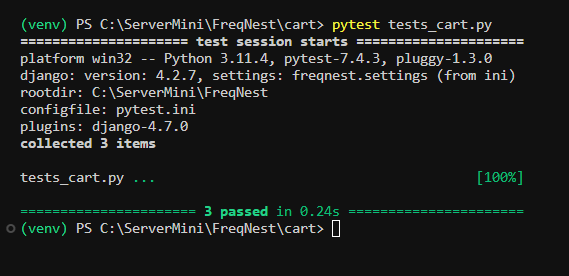

### Synths App Testing

#### Test 4: Product Display
- **Objective**: Verify the accurate display of synth details.
- **Result**: The product display is accurate and reliable.
- **Issues**: No issues encountered during testing.

#### Test 5: Category Functionality
- **Objective**: Test the effective sorting of synths by categories.
- **Result**: Synths are sorted by categories as intended.
- **Issues**: No issues encountered during testing.

### Profiles App Testing

#### Test 6: Profile Updates
- **Objective**: Ensure users can update their profiles with new information.
- **Result**: Profile updates work correctly.
- **Issues**: No issues encountered during testing.

#### Test 7: Security and Authentication
- **Objective**: Test the integrity and security of user authentication processes.
- **Result**: Authentication processes are secure and functioning as expected.
- **Issues**: No issues encountered during testing.

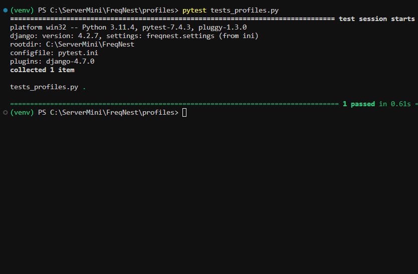

### Users App Testing

The Users app underwent extensive testing to ensure a seamless and secure user experience. Here are the detailed tests, their results, and encountered issues:

#### Test 8: User Registration
- **Objective**: Verify that new users can register successfully.
- **Result**: New user registration is successful with proper data validation and error handling.
- **Issues**: No issues encountered during testing.

#### Test 9: User Login and Logout
- **Objective**: Test the login and logout processes.
- **Result**: Login and logout functions work correctly, and user sessions are managed properly.
- **Issues**: No issues encountered during testing.

#### Test 10: Authentication Required Views
- **Objective**: Ensure that certain views are inaccessible without proper authentication.
- **Result**: Unauthorized users are redirected to the login page for protected views, maintaining data security.
- **Issues**: No issues encountered during testing.

#### Test 11: Cart and Checkout Process
- **Objective**: Test the entire cart and checkout process.
- **Result**: Adding and removing items, updating quantities, and checkout processes function accurately.
- **Issues**: No issues encountered during testing.

#### Test 12: Order Saving and Validation
- **Objective**: Validate the order saving process.
- **Result**: Order saving and handling of various scenarios, including invalid data, are successful.
- **Issues**: No issues encountered during testing.

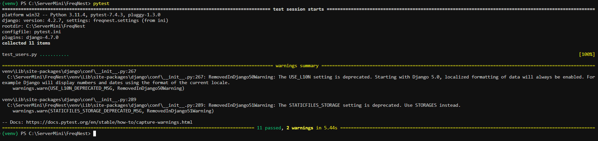

These tests played a crucial role in enhancing the reliability and robustness of the Users app, ensuring a user-friendly experience while maintaining data integrity and security standards.

### Checkout App Testing

#### Test 13: Payment Processing
- **Objective**: Test Stripe integration for secure payments.
- **Result**: Payment processing functions as expected.
- **Issues**: No issues encountered during testing.

#### Test 14: Order Finalization
- **Objective**: Ensure users can complete orders and receive confirmation.
- **Result**: Order finalization works correctly, and users receive confirmation.
- **Issues**: No issues encountered during testing.

### Lighthouse Performance Testing

#### Test 15: Overall Performance
- **Objective**: Evaluate website loading speed and rendering performance using Google Lighthouse.
- **Key Metrics**: First Contentful Paint (FCP), Largest Contentful Paint (LCP), First Meaningful Paint, Speed Index.
- **Results**: The website meets essential security standards and mobile responsiveness but shows opportunities for improvement in loading speed and visual content rendering.
- **Issues**: Identified issues include order history import to profiles, input fields not displaying correctly, typos, and pagination. These issues are actively being addressed in the development process.
  
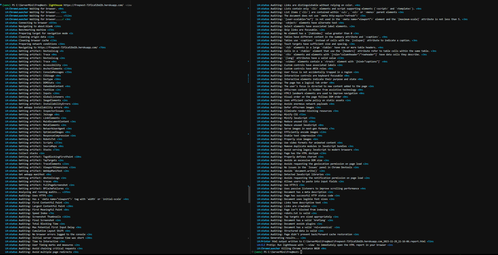

## Data Flow Map
A seamless and efficient user experience from browsing to purchase:

### User Interface
- **Main Page**: Registration and login.
- **Profile Page**: Managing profile and order history.
- **Synths Collection**: Browsing and adding items to the cart.
- **Cart**: Reviewing and adjusting selections for checkout.

### Backend Logic
- **Authentication**: User login sessions and security.
- **User Profiles**: Retrieval and storage of user details.
- **Product Management**: Maintenance of product details.
- **Order Processing**: Creation and management of orders.

### Data Storage
- **Database**: PostgreSQL for persistent data storage.
- **Session Storage**: Temporary data like current cart contents.

### External Services
- **Stripe Integration**: Secure payment transactions.
- **AWS S3**: Storing and serving static and media files.

## Data Schema
Below is the Data Schema representing the structure of the database and the relations between different parts of the application:

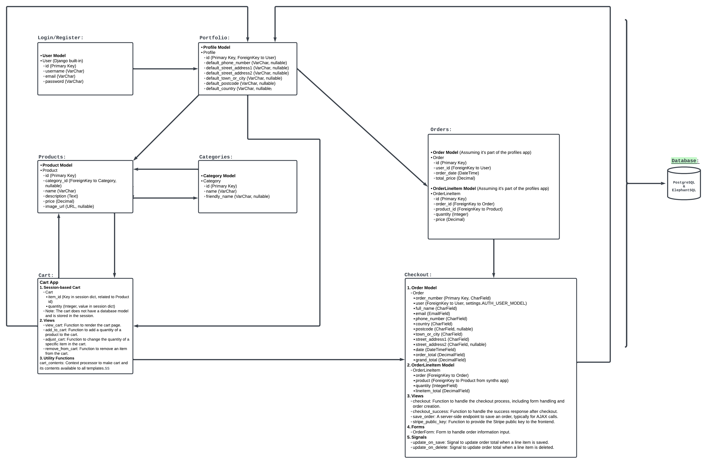

# Deployment

## Deployment and Hosting
### 🚀 Heroku Deployment Overview
Key highlights of deploying FreqNest to Heroku:

- **Frequent Updates**: Continuous evolution with multiple daily deployments.
- **Rapid Builds**: Demonstrating efficient deployment pipeline.
- **Immediate Rollbacks**: Capability to revert to previous versions to minimize service interruptions.

### Commitment to Stability and Performance
Monitoring each deployment for stability and performance, with regular updates for a reliable and efficient application.

### 🚀 Deployment on GitHub
Documenting the development process and version control using GitHub:

#### Commit Chronicles
- **Visual Enhancements**: CSS updates.
- **Template Refinements**: Improvements in `synths` and `checkout` templates.
- **Profile Updates**: Enhanced handling of user details in `profiles`.

#### Backend Optimizations
- **Django Settings**: Updates for smooth operation and security, especially for Heroku.
- **Data Management**: Improved data models for integrity and performance.

#### Deployment Specifics
- **Heroku Settings**: Configuration for smooth deployment.
- **Static Assets**: Addressing image load issues for proper serving in production.

### Ongoing Development
Continuous integration and deployment are part of the project ethos, with each commit pushing towards the next milestone.

#  Resources

- **[Code Institute](https://codeinstitute.net/)**: A treasure trove of web development tutorials and materials.
- **[Google](https://www.google.com/)**: The go-to for solutions to all coding challenges.
- **[YouTube](https://www.youtube.com/)**: A sea of coding tutorials and walkthroughs.
- **[freeCodeCamp](https://www.freecodecamp.org/)**: A haven for free coding lessons and resources.
- **[Google Developers Training](https://developers.google.com/training)**: Comprehensive courses on various development topics provided by Google.
- **[IBM Developer](https://developer.ibm.com/)**: A platform by IBM offering a wide range of tutorials, code patterns, and APIs to enhance development skills.

A heartfelt gratitude to the numerous creators and educators who've shared their expertise.

---

# Credits

#### **Code and Content**
Every line of code and content, painstakingly penned down by [Sandor Gyorfi](https://github.com/sandorgyorfi).

### **Acknowledgements**
Very Thanks to:

- Ben Smith, Pasquale Fasulo from City of Bristol College.
- The Code Institute.

For their insights, resources, and unwavering support.

---

##  Contact
Queries? Feedback? Drop an email at [mr.sandorgyorfi@gmail.com](mailto:mr.sandorgyorfi@gmail.com).

---

