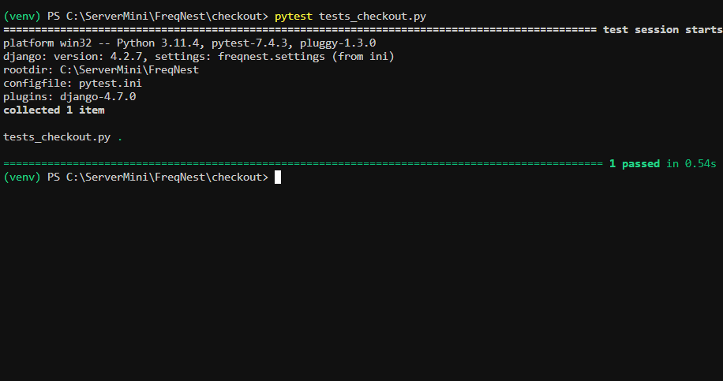

# Table of Contents
- [Features](#features)
- [UX Plane](#ux-plane)

- [Data Flow Map](#data-flow-map)
- [Tests and Results](#tests-and-results)
- [Deployment](#deployment)
- [Resources](#resources)
- [Credits](#credits)
- [Contact](#contact)

## Features
Welcome to FreqNest, where we blend passion for music with technology to create an unmatched synth shopping experience. Here's a closer look at the features that make your journey with us special.

## Live View
Check out FreqNest live: [FreqNest Live Demo](https://freqnest-72f2ca52bd2b.herokuapp.com/)

### Easy Registration: Your First Step into Our World
- **Simple Sign-Up Process**: Joining FreqNest is easy. Choose a unique username, provide your email, create a secure password, and you're in.
- **Personalized Experience**: Your account opens the door to features like saved favorites, order tracking, and personalized recommendations.

### Your Personal Music Profile: Control at Your Fingertips
- **Manage Your Details**: Update your username, email, and contact information with ease.
- **Order History**: View all your past orders and their details in one place.
- **Account Deletion**: Your privacy and choices are respected—delete your account anytime if you choose to leave.

### Shopping Cart: Your Curated Synth Collection
- **Review and Adjust**: Easily add, review, and remove synths from your cart.
- **Transparent Pricing**: See the total cost of your selections before proceeding to checkout.

### Explore Our Synths Collection: A Musical Adventure
- **Diverse Range**: From vintage to modern, our collection caters to all tastes and needs.
- **User-Friendly Browsing**: Sort and filter synths to find your perfect match quickly.
- **Detailed Synth Views**: Click on any synth for an in-depth look at its features and specs.

### Secure Checkout: Smooth and Safe Transaction
- **Effortless Checkout Process**: Fill out your details and proceed to payment without any hassle.
- **Stripe Integration**: Enjoy peace of mind with secure payment processing by Stripe.
- **Privacy Ensured**: We safeguard your personal information at every step.

## UX Plane
Creating FreqNest, I focused on each aspect of the user experience, ensuring that your journey through the world of synthesizers is both enjoyable and intuitive. Here's how I approached the different UX planes for FreqNest.

### Strategy Plane
- **User Needs**: You, the synth enthusiasts, are looking for a diverse range of products, clear information, and a seamless shopping experience.
- **My Goals**: To provide an easy-to-navigate, informative, and comprehensive online platform catering to all your synth needs.
- **My Goals**: To provide an easy-to-navigate, informative, and comprehensive online platform catering to all your synth needs.

### Scope Plane
- **Features**: Detailed product descriptions, a secure shopping cart, user profile management, and an efficient checkout process.
- **Content Requirements**: High-quality images, informative product descriptions, and straightforward navigation for an educational and enjoyable visit.

### Structure Plane
- **Information Architecture**: Intuitive product categories and an easy-to-understand layout.
- **Interaction Design**: Interactive elements like sorting options and clickable categories enhance your exploration and purchasing process.

### Skeleton Plane
- **Interface Design**: Clean and visually appealing interface, showcasing synths effectively.
- **Navigation Design**: Consistent and clear menu structures for quick and efficient user navigation.

### Surface Plane
- **Visual Design**: Aesthetically pleasing design that resonates with your passion for synths, utilizing colors, typography, and imagery.
- **Sensory Experience**: Engaging and immersive experience, capturing the essence and excitement of the synthesizer world.

## Technologies and Frameworks Utilized for FreqNest
Building FreqNest was an exciting journey, and here are the tools I used:

### Frontend Development
- **HTML5 and CSS3**: Structuring and styling the website.
- **JavaScript and jQuery**: Adding interactivity for a dynamic browsing experience.

### Backend Development
- **Django**: High-level Python Web framework for a robust, secure, and scalable application.
- **Python**: Core programming language for efficiency and readability.

### Database Management
- **PostgreSQL**: Storing and managing user data, product information, and crucial data reliably.

### Payment Processing
- **Stripe**: Integrated for secure online transactions.

## Tests and Results
Rigorous testing was conducted for each aspect of the application:

### Cart App Testing
- **Adding Items**: Ensuring users can add synths to their cart.
- **Removing Items**: Verifying the removal of items from the cart.
- **Cart Notification**: Updating users with notifications appropriately.

### Synths App Testing
- **Product Display**: Accurate display of synth details.
- **Category Functionality**: Effective sorting of synths by categories.

### Profiles App Testing
- **Profile Updates**: Users can update their profiles with new information.
- **Security and Authentication**: Integrity and security of user authentication processes.

### Checkout App Testing
- **Payment Processing**: Testing Stripe integration for secure payments.
- **Order Finalization**: User completion of orders and receiving confirmation.

## Data Flow Map
A seamless and efficient user experience from browsing to purchase:

### User Interface
- **Main Page**: Registration and login.
- **Profile Page**: Managing profile and order history.
- **Synths Collection**: Browsing and adding items to the cart.
- **Cart**: Reviewing and adjusting selections for checkout.

### Backend Logic
- **Authentication**: User login sessions and security.
- **User Profiles**: Retrieval and storage of user details.
- **Product Management**: Maintenance of product details.
- **Order Processing**: Creation and management of orders.

### Data Storage
- **Database**: PostgreSQL for persistent data storage.
- **Session Storage**: Temporary data like current cart contents.

### External Services
- **Stripe Integration**: Secure payment transactions.
- **AWS S3**: Storing and serving static and media files.

# Deployment

## Deployment and Hosting
### 🚀 Heroku Deployment Overview
Key highlights of deploying FreqNest to Heroku:

- **Frequent Updates**: Continuous evolution with multiple daily deployments.
- **Rapid Builds**: Demonstrating efficient deployment pipeline.
- **Immediate Rollbacks**: Capability to revert to previous versions to minimize service interruptions.

### Commitment to Stability and Performance
Monitoring each deployment for stability and performance, with regular updates for a reliable and efficient application.

### 🚀 Deployment on GitHub
Documenting the development process and version control using GitHub:

#### Commit Chronicles
- **Visual Enhancements**: CSS updates.
- **Template Refinements**: Improvements in `synths` and `checkout` templates.
- **Profile Updates**: Enhanced handling of user details in `profiles`.

#### Backend Optimizations
- **Django Settings**: Updates for smooth operation and security, especially for Heroku.
- **Data Management**: Improved data models for integrity and performance.

#### Deployment Specifics
- **Heroku Settings**: Configuration for smooth deployment.
- **Static Assets**: Addressing image load issues for proper serving in production.

### Ongoing Development
Continuous integration and deployment are part of the project ethos, with each commit pushing towards the next milestone.

#  Resources

- **[Code Institute](https://codeinstitute.net/)**: A treasure trove of web development tutorials and materials.
- **[Google](https://www.google.com/)**: The go-to for solutions to all coding challenges.
- **[YouTube](https://www.youtube.com/)**: A sea of coding tutorials and walkthroughs.
- **[freeCodeCamp](https://www.freecodecamp.org/)**: A haven for free coding lessons and resources.
- **[Google Developers Training](https://developers.google.com/training)**: Comprehensive courses on various development topics provided by Google.
- **[IBM Developer](https://developer.ibm.com/)**: A platform by IBM offering a wide range of tutorials, code patterns, and APIs to enhance development skills.

A heartfelt gratitude to the numerous creators and educators who've shared their expertise.

---

# Credits

#### **Code and Content**
Every line of code and content, painstakingly penned down by [Sandor Gyorfi](https://github.com/sandorgyorfi).

### **Acknowledgements**
Very Thanks to:

- Ben Smith, Pasquale Fasulo from City of Bristol College.
- The Code Institute.

For their insights, resources, and unwavering support.

---

##  Contact
Queries? Feedback? Drop an email at [mr.sandorgyorfi@gmail.com](mailto:mr.sandorgyorfi@gmail.com).

---

